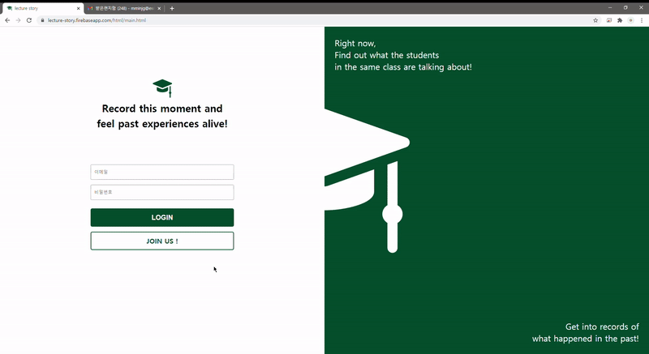

[![Contributors][contributors-shield]][contributors-url]

<!-- PROJECT LOGO -->
 

  

  <h2 align="center">Lecture Story</h2>

  

    New Lecture Review Forum
     2020-2 Open Software Platform
     
    <a href="https://lecture-story.firebaseapp.com">URL</a>
  

### Contributors

1971002 강민지([mminjg](https://github.com/mminjg))  
1971019 박주은([hoit1302](https://github.com/hoit1302))  
1971039 이진경([dooli1971039](https://github.com/dooli1971039), lkh4317)  
1971051 최수정([sujeong000](https://github.com/sujeong000))

 

  
Table of Contents

  <ol>
    <li><a href="#about-the-project">About The Project</a></li>
    <li><a href="#URL">URL</a></li>
    <li><a href="#Main Features">Main Features</a></li>
  </ol>

## About The Project

2020 2nd semester 'Open Software Platform' final project  
Tools: HTML, CSS, Javascript, Firebase

Students usually use the school community to get information about lectures.  
For example, asking questions about assignments, checking the ranks of their own scores and evaluating lectures.

However, since the existing school community forums are not divided for _each lecture_, it is difficult to find information about the same lectures in the current and past semesters.  
Also, It is also important to know the flow of the past semester because knowing the grade standards, assignment information, or problem solving tips is helpful in learning and when choosing a lecture.

So we focused on making it easy to obtain lecture information(evaluation, score, etc.) with timeline and useful for lecture learning.

## URL

https://lecture-story.firebaseapp.com  
supported browser: chrome

## Main Features

### Email Authentication & Course Bookmark

- Sign up through ewhain email verification (@ewhain.net)
- Add lecture bookmark

### Lecture Forum with Timeline

- Click tag, view articles by topic(tag)
- Write postings with a tag, edit, and delete
- Read postings and leave comments

### Score Statistics

- Enter Score with tag only once
- Check ranks only when score is entered

### Periodic Course Evaluation with Timeline

- Write quarterly review
- Check the review of last semester

[contributors-shield]: https://img.shields.io/github/contributors/othneildrew/Best-README-Template.svg?style=for-the-badge
[contributors-url]: https://github.com/sujeong000/Lecture_Story/graphs/contributors
